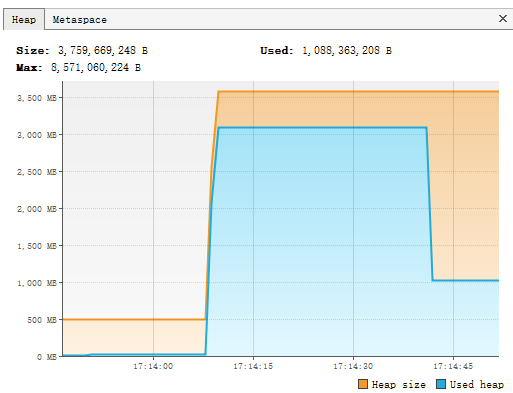

# 线程上下文设计模式

## 1. 什么是上下文

上下文（context）在开发过程中经常会遇到，比如struts2的ActionContext、Spring的ApplicationContext。

上下文是贯穿整个系统或阶段生命周期的对象，其中包含了系统全局的一些信息，比如登录之后的用户信息、账号信息，以及程序运行时的数据。

下面是典型的使用单例对象充当系统级别上下文的例子：

```java
public class ApplicationContext {
    // 在context中保存configuration实例
    private ApplicationConfiguration configuration;
    // 在context中保存runtimeInfo实例
    private RuntimeInfo runtimeInfo;
    // ...其他实例

    // 采用Holder实现单例
    private static class Holder {
        private static ApplicationContext instance = new ApplicationContext();
    }
    public static ApplicationContext getContext() {
        return Holder.instance;
    }
    public void setConfiguration(ApplicationConfiguration configuration) {
        this.configuration = configuration;
    }
    public ApplicationConfiguration getConfiguration() {
        return configuration;
    }
    public void setRuntimeInfo(RuntimeInfo runtimeInfo) {
        this.runtimeInfo = runtimeInfo;
    }
    public RuntimeInfo getRuntimeInfo() {
        return runtimeInfo;
    }
}
```

## 2. 线程上下文设计

有时候，单个线程执行的任务步骤会很多，前一个步骤的输出可能是后一个步骤的输入。
在单个线程多步骤执行时，为了使得功能单一，有时候我们会采用职责链设计模式。

可以看到需要将context从头传到尾，显然是比较繁琐得设计，我们可以采用线程的上下文设计来解决这样的问题.

我们在ApplicationContext中增加ActionContext（线程上下文）相关的内容，代码如下：

```java
import tech.huangyt.concurrency.ActionContext;

import java.util.concurrent.ConcurrentHashMap;

public class ApplicationContext {
    // 略去上一小节代码

    private ConcurrentHashMap<Thread, ActionContext> contexts = new ConcurrentHashMap<>();
    public ActionContext getActionContext() {
        ActionContext actionContext = contexts.get(Thread.currentThread());
        if (actionContext == null) {
            actionContext = new ActionContext();
            contexts.put(Thread.currentThread(), actionContext);
        }
        return actionContext;
    }
}
```

不同线程访问getActionContext()，每个线程都会获得不一样的ActionContext实例，这样就可以保证线程之间上下文的独立性，
同时也不用考虑ActionContext的线程安全性，因此线程上下文又被称为“线程级别的单例”。

需要注意的是这种方式定义的线程上下文可能会导致内存泄漏。
contexts是一个Map的数据结构，用当前线程做key，当线程的生命周期结束后，contexts中的Thread实例不会被释放，
与之对应的value也不会被释放，时间长了就会导致内存泄漏。
当然可以通过soft reference或者weak reference等引用类型，JVM会主动尝试回收。

## 3. ThreadLocal详解

ThreadLocal为每一个使用该变量的线程都提供了独立的副本，可以做到线程间的数据隔离，每一个线程都可以访问各自内部的副本变量。

### 3.1 ThreadLocal的使用场景和注意事项

一般在以下情况下会使用到ThreadLocal：

* 在进行对象跨层传递的时候，可以考虑使用ThreadLocal，避免方法多次传递，打破层次间的约束
* 线程间数据隔离，例如上小节描述的线程上下文ActionContext
* 进行事务操作，用于存储线程事务信息

ThreadLocal并不是解决多线程下共享资源的技术，一般情况下，每个线程的ThreadLocal存储的都是一个全新的对象（通过new创建），
如果多线程的ThreadLocal存储了一个对象的引用，那么它还将面临资源竞争，数据不一致等并发问题。

### 3.2 ThreadLocal的方法详解和源码分析

我们先看一个ThreadLocal的使用例子：

```java
public class ThreadLocalExample {
    public static void main(String[] args) {
        // 创建ThreadLocal实例
        ThreadLocal<Integer> tLocal = new ThreadLocal<>();
        // 创建10个线程，使用tLocal
        IntStream.range(0, 10)
                .forEach(i -> new Thread(() -> {
                    try {
                        // 每个线程都会设置tLocal，但是彼此之间的数据是独立的
                        tLocal.set(i);
                        System.out.println(currentThread() + " set i " + tLocal.get());
                        TimeUnit.SECONDS.sleep(1);
                        System.out.println(currentThread() + " get i " + tLocal.get());
                    } catch (InterruptedException e) {
                        e.printStackTrace();
                    }
                }).start());
    }
}
```

上面的代码定义了一个全局唯一的ThreadLocal&lt;Integer&gt;，然后启动了10个线程对tLocal进行set和get操作。
通过下面的输出可以看出这10个线程之间彼此不会相互影响，每个存入tLocal的值都是相互独立的。

```
Thread[Thread-0,5,main] set i 0
Thread[Thread-2,5,main] set i 2
Thread[Thread-1,5,main] set i 1
Thread[Thread-4,5,main] set i 4
Thread[Thread-3,5,main] set i 3
Thread[Thread-6,5,main] set i 6
Thread[Thread-8,5,main] set i 8
Thread[Thread-7,5,main] set i 7
Thread[Thread-5,5,main] set i 5
Thread[Thread-9,5,main] set i 9
Thread[Thread-6,5,main] get i 6
Thread[Thread-8,5,main] get i 8
Thread[Thread-0,5,main] get i 0
Thread[Thread-9,5,main] get i 9
Thread[Thread-4,5,main] get i 4
Thread[Thread-7,5,main] get i 7
Thread[Thread-1,5,main] get i 1
Thread[Thread-2,5,main] get i 2
Thread[Thread-3,5,main] get i 3
Thread[Thread-5,5,main] get i 5
```

在使用ThreadLocal的时候，最常用的方法就是initialValue()、set(T t)和get()。

#### 3.2.1 initialValue()方法

initialValue()方法为ThreadLocal要保存的数据类型指定了一个初始值，在ThreadLocal中默认返回值为bull，代码如下：
```java
    protected T initialValue() {
        return null;
    }
```

我们可以通过重写initialValue()方法进行数据的初始化，例如下面的代码，线程并未对threadLocal进行set操作，
但是还是可以通过get方法得到一个初始值，而且每一个线程通过get方法获取的值都是不一样的：

```java
    ThreadLocal<Object> tLocal = new ThreadLocal<Object>() {
        @Override
        protected Object initialValue() {
            return new Object();
        }
    }
    new Thread(() -> System.out.println(tLocal.get())).start();
    System.out.println(tLocal.get());
```

另外，在JDK1.8及以上，可以使用Supplier函数接口简化：
```java
    ThreadLocal<Object> tLocal = ThreadLocal.withInitial(Object::new);
```

#### 3.2.2 set(T t)方法

下面是set(T t)方法的源码：

```java
    // ThreadLocal的set方法
    public void set(T value) {
        Thread t = Thread.currentThread();
        ThreadLocalMap map = getMap(t);
        if (map != null) 
            map.set(this, value);
        else
            createMap(t, value);
    }
    
    // ThreadLocal的createMap方法
    void createMap(Thread t, T firstValue) {
        t.threadLocals = new ThreadLocalMap(this, firstValue);
    }
    
    // ThreadLocalMap的set方法
    private void set(ThreadLocal<?> key, Object value) {
        Entry[] tab = table;
        int len = tab.length;
        int i = key.threadLocalHashCode & (len - 1);
        for (Entry e = tab[i]; e != null; e = tab[i = nextIndex(i, len)]) {
            ThreadLocal<?> k = e.get();
            if (k == key) {
                e.value = value;
                return;
            }
            if (k == null) {
                replaceStaleEntry(key, value, i);
                return;
            }
        }
        tab[i] = new Entry(key, value);
        int sz = ++size;
        if (!cleanSomeSlots(i, sz) && sz >= threshold)
            rehash();
    }
```

#### 3.2.3 get()方法

下面是get()方法的源码：

```java
    public T get() {
        Thread t = Thread.currentThread();
        ThreadLocalMap map = getMap(t);
        if (map != null) {
            ThreadLocalMap.Entry e = map.getEntry(this);
            if (e != null){
                T result = (T)e.value;
                return result;
            }
        }
        return setInitialValue();
    }
    
    private T setInitialValue() {
        T value = initialValue();
        Thread t = Thread.currentThread();
        ThreadLocalMap map = getMap(t);
        if (map != null)
            map.set(this, value);
        else
            createMap(t, value);
        return value;
    }
```

#### 3.2.4 ThreadLocalMap

无论get还是set方法都要和ThreadLocalMap和Entry打交道，
ThreadLocalMap是一个完全类似于HashMap的数据结构，仅仅用于存放线程存放在ThreadLocal中的数据备份。
ThreadLocalMap的所有方法对外部都完全不可见。

在ThreadLocalMap中用于存储数的是Entry，它是一个WeakReference类型的子类。
之所以设计为WeakReference是为了能够在JVM发生垃圾回收时能够自动回收防止内存溢出。

以下是ThreadLocalMap的Entry源码：

```java
import java.lang.ref.WeakReference;

static class Entry extends WeakReference<ThreadLocal<?>> {
    // The value associated with this ThreadLocal
    Object value;
    Entry(ThreadLocal<?> k, Object v) {
        super(k);
        value = v;
    }
}
```

### 3.3 ThreadLocal的内存泄漏问题分析

新版的JDK中，ThreadLocal为解决内存泄漏做了很多工作：

* WeakReference在JVM中触发任意GC时都会导致Entry回收
* 在get数据时增加检查，清除已经被垃圾回收器回收的Entry
```java
    // ThreadLocalMap的方法
    private Entry getEntryAfterMiss(ThreadLocal<?> key, int i, Entry e) {
        Entry[] tab = table;
        int len = tab.length;
        // 查找key为null的Entry
        while (e != null) {
            ThreadLocal<?> k = e.get();
            if (k == key)
                return e;
            if (k == null)
                // 将key为null的Entry删除
                expungeStaleEntry(i);
            else
                i = nextIndex(i, len);
            e = tab[i];
        }
        return null;
    }
    
    private boolean cleanSomeSlots(int i, int n) {
        boolean removed = false;
        Entry[] tab = table;
        int len = tab.length;
        do {
            i = nextIndex(i, len);
            Entry e = tab[i];
            if (e != null && e.get() == null) {
                n = len;
                removed = true;
                // 将key为null的Entry删除
                i = expungeStaleEntry(i);
            }
        } while ((n >>>= 1) != 0);
        return removed;
    }
    
    // 执行Entry在ThreadLocalMap中的删除动作
    private int expungeStaleEntry(int staleSlot) {
        Entry[] tab = table;
        int len = tab.length;
        // expunge entry at staleSlot
        tab[staleSlot].value = null;
        tab[staleSlot] = null;
        size--;
        // rehash until we encounter null
        Entry e;
        int i;
        for (i = nexIndex(staleSlot, len); (e = tab[i]) != null; i = nextIndex(i, len)) {
            ThreadLocal<?> k = e.get();
            if (k == null) {
                e.value = null;
                tab[i] = null;
                size--;
            } else {
                int h = k.threadLocalHashCode & (len - 1);
                if (h != i) {
                    tab[i] = null;
                    while (tab[h] != null)
                        h = nextIndex(h, len);
                    tab[h] = e;
                }       
            }
        }
        return i;
    }
```
* 在set数据时增加检查，删除已经被垃圾回收器清除的Entry，并且将其移除，代码同上。

通过以上三点，ThreadLocal可以在一定程度上保证不发生内存泄漏。

但是并不能完全避免内存溢出，考虑下面代码

```java
    ThreadLocal<byte[]> threadLocal = new ThreadLocal<>();
    TimeUnit.SECONDS.sleep(30);
    threadLocal.set(new byte[1024 * 1024 * 1024]);
    threadLocal.set(new byte[1024 * 1024 * 1024]);
    threadLocal.set(new byte[1024 * 1024 * 1024]);
    threadLocal = null;
    Thread.currentThread().join();
```

该代码首先定义了一个ThreadLocal<byte[]>，分三次设置了1G的数据，然后将threadLocal设置为null。
最后手动进行一次gc，可以看到内存变化如下图：



内存占用会先达到3G以上，手动gc后，内存占用会降到1G，之后不论进行多少次gc，这1G的内存都不会得到释放。

当ThreadLocal被显式地指定为null之后，执行gc操作，这时堆内存中地ThreadLocal被回收，
同时ThreadLocalMap中地Entry.key变成null，但是value将不会被释放，除非当前线程已经结束了生命周期，Thread被垃圾回收器回收。

需要养成良好的习惯，用完ThreadLocal时，调用一次threadLocal.remove()或者threadLocal.set(null)。

## 4. 使用ThreadLocal设计线程上下文

```java
public class ActionContext {

    private static final ThreadLocal<Context> context = ThreadLocal.withInitial(Context::new);

    public static Context get() {
        return context.get();
    }

    static class Context {
        private Configuration configuration;
        private OtherResource otherResource;

        public Configuration getConfiguration() {
            return configuration;
        }

        public void setConfiguration(Configuration configuration) {
            this.configuration = configuration;
        }

        public OtherResource getOtherResource() {
            return otherResource;
        }

        public void setOtherResource(OtherResource otherResource) {
            this.otherResource = otherResource;
        }
    }
}
```